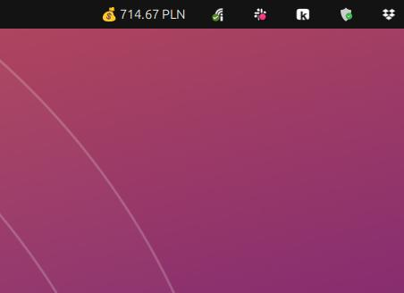

# Stripe Earnings in GNOME Top Bar

Display today's Stripe gross volume in your Ubuntu/GNOME top bar using [Argos](https://extensions.gnome.org/extension/1176/argos/).




Auto-refreshes every 5 minutes. Click to see details or open Stripe Dashboard.

## Requirements

- Ubuntu / GNOME Shell
- [Argos extension](https://extensions.gnome.org/extension/1176/argos/)
- Python 3.6+
- Stripe account with API access

No external Python packages needed - uses only the standard library.

## Setup

### 1. Install libsecret-tools

Required for secure API key storage in GNOME Keyring:

```bash
sudo apt install libsecret-tools
```

### 2. Install Argos

Install from [GNOME Extensions](https://extensions.gnome.org/extension/1176/argos/) or via CLI:

```bash
gnome-extensions install argos@pew.worldwidemann.com
```

### 3. Create a Stripe Restricted Key

In [Stripe Dashboard](https://dashboard.stripe.com/apikeys) create a **Restricted Key** with minimal permissions:

| Resource | Permission |
|----------|------------|
| **Core > Balance** | Read |

Everything else can stay at `None`. This way the key can only read transaction amounts - nothing else.

### 4. Store the API key securely

The script reads the key from **GNOME Keyring** (encrypted, unlocked on login):

```bash
secret-tool store --label="Stripe API Key" service stripe type api-key
```

Paste your key (`rk_live_...`) and press Enter.

### 5. Install the script

```bash
git clone https://github.com/hexplor/stripe-earnings.git
ln -s "$(pwd)/stripe-earnings/stripe_gross.5m.py" ~/.config/argos/
chmod +x stripe-earnings/stripe_gross.5m.py
```

The `5m` in the filename means "refresh every 5 minutes". Argos will pick it up automatically.

### Changing the refresh interval

Rename the symlink in `~/.config/argos/`:

| Filename | Interval |
|----------|----------|
| `stripe_gross.30s.py` | 30 seconds |
| `stripe_gross.1m.py` | 1 minute |
| `stripe_gross.5m.py` | 5 minutes |
| `stripe_gross.10m.py` | 10 minutes |

```bash
cd ~/.config/argos
mv stripe_gross.5m.py stripe_gross.1m.py   # switch to 1 minute
```

## How it works

1. Reads the Stripe API key from GNOME Keyring via `secret-tool`
2. Fetches today's balance transactions (`charge` + `payment` types) from the Stripe API
3. Sums up gross volume, grouped by currency
4. Outputs in [Argos format](https://github.com/p-e-w/argos) for display in the top bar

Handles pagination automatically if you have more than 100 transactions per day.

## Dropdown menu

Clicking the top bar item shows:

- Gross volume breakdown by currency
- Transaction date
- Link to Stripe Dashboard
- Manual refresh button

## License

MIT
